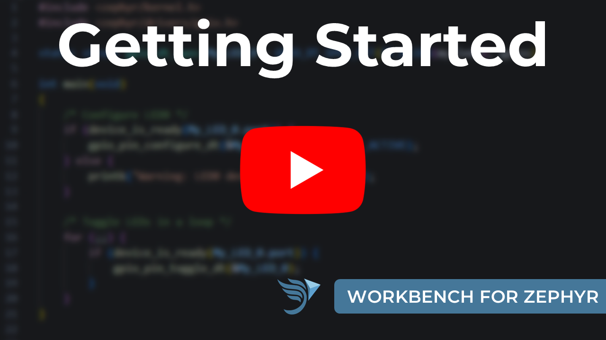

# Workbench for Zephyr (VS Code)

Ac6 Workbench for Zephyr is a VS Code extension that adds support of Zephyr development to Visual Studio Code, including host tools installation, SDK and toolchain management, west workspace management, project creation, build, flash and debug, Kconfig and devicetree editing, memory analysis, static code analysis and SBOM generation.

The extension is available on the [VS Code Marketplace](https://marketplace.visualstudio.com/items?itemName=Ac6.zephyr-workbench) and on [Open VSX](https://open-vsx.org/extension/Ac6/zephyr-workbench).

  

## Features

* [Install native host tools](https://z-workbench.com/docs/documentation/host-tools-manager) (Python, CMake, Ninja, ...) in a sandboxed location, with an advanced mode to select individual tools
* [Install and manage toolchains](https://z-workbench.com/docs/documentation/sdk): Zephyr SDK (full or minimal, with optional LLVM/Clang), ARM GNU, IAR ARM and Rust
* Detect and use Zephyr SDKs installed globally or locally
* [Import west workspaces](https://z-workbench.com/docs/documentation/west-workspace) from a template, a repository, a local folder or a manifest file
* Manage west manifests, west blobs and per-workspace Python environments with the West Manager
* [Create application projects](https://z-workbench.com/docs/documentation/application) for a specific board from a sample, or import existing applications
* [Define multiple build configurations](https://z-workbench.com/docs/documentation/multibuild) per application, with [sysbuild](https://z-workbench.com/docs/documentation/configuration/sysbuild), shields and snippets support
* Build and flash applications from the status bar, the command palette or the Applications view
* Open a Zephyr terminal with the build environment sourced (PowerShell, bash, zsh, Git Bash, MSYS2 or Cygwin)
* [Debug](https://z-workbench.com/docs/documentation/debug-session) with OpenOCD, J-Link, pyOCD, LinkServer, ST-LINK GDB Server, STM32CubeProgrammer, nRF tools or Simplicity Commander, using the built-in backend or Cortex-Debug
* Generate launch configurations with the Debug Manager, manage pyOCD target packs, [install runners](https://z-workbench.com/docs/documentation/install-runners) from the extension
* Configure applications with the Kconfig Manager GUI, [menuconfig](https://z-workbench.com/docs/documentation/configuration/menuconfig), [guiconfig](https://z-workbench.com/docs/documentation/configuration/guiconfig) or [hardenconfig](https://z-workbench.com/docs/documentation/configuration/hardenconfig)
* Edit devicetree and pin muxing with the [Devicetree Manager](https://z-workbench.com/docs/documentation/devicetree-manager), with [DTS language server](https://z-workbench.com/docs/documentation/dts-lsp) support out of the box
* [Analyze memory usage](https://z-workbench.com/docs/category/memory-analysis) with RAM/ROM reports, plots and puncover
* Inspect builds in the Zephyr Dashboard: application summary, sys-init data and RAM/ROM usage with ELF size breakdown
* [Run static code analysis](https://z-workbench.com/docs/category/static-code-analysis) with ECLAIR (MISRA, BARR-C, AUTOSAR) and diagnose devicetree errors with DT Doctor
* [Generate SPDX 2.3 and SPDX 3.0 SBOM documents](https://z-workbench.com/docs/tutorials/spdx), verify them with SBOM Total and export PDF, DOCX or Markdown reports
* IntelliSense with the C/C++ extension or clangd
* Supported on Windows, Linux and macOS, including [VS Code Portable mode](https://z-workbench.com/docs/documentation/vscode-zephyr-workbench-portable)

## Quick Start

1. Click on the Workbench for Zephyr icon in the activity bar
2. [Install Host Tools](https://z-workbench.com/docs/documentation/installation): the native tools are downloaded into `${USERDIR}/.zinstaller` (takes ~5 minutes)
3. [Add a toolchain](https://z-workbench.com/docs/documentation/sdk): import an official Zephyr SDK or register an already installed one
4. [Add a west workspace](https://z-workbench.com/docs/documentation/west-workspace): from a template, a repository, a local folder or a manifest file (takes ~10 minutes)
5. [Create a new application](https://z-workbench.com/docs/documentation/application): select the west workspace, the toolchain, the board and a sample project
6. Build from the status bar, then configure your debug session with the [Debug Manager](https://z-workbench.com/docs/documentation/debug-session)

Step-by-step guides are available for [Windows](https://z-workbench.com/docs/documentation/getting-started/getting-started-win), [Linux](https://z-workbench.com/docs/documentation/getting-started/getting-started-linux) and [macOS](https://z-workbench.com/docs/documentation/getting-started/getting-started-macosx).

## Supported toolchains

| Toolchain | Notes |
|-----------|-------|
| Zephyr SDK | Official SDK, full or minimal install, all Zephyr target architectures |
| LLVM/Clang | Optional download together with a Zephyr SDK |
| ARM GNU Toolchain | arm-none-eabi and aarch64-none-elf |
| IAR ARM Toolchain | Registered with an IAR license token, a Zephyr SDK is still required for the host utilities |
| Rust | `zephyr-lang-rust` module, standalone toolchain or rustup |

Zephyr SDKs installed globally with `west sdk` are detected automatically, shown with a `[global]` badge in the Toolchains view and selectable as an application toolchain.

## Supported debug runners

| Runner | Notes |
|--------|-------|
| OpenOCD | Zephyr, ESP32, xPack, Infineon, TI or custom variants |
| J-Link | SEGGER |
| pyOCD | Target packs managed with the pyOCD Manager |
| LinkServer | NXP |
| ST-LINK GDB Server | STMicroelectronics |
| STM32CubeProgrammer | STMicroelectronics |
| nrfjprog, nRF Util | Nordic Semiconductor |
| Simplicity Commander | Silicon Labs |

Debug sessions run on the built-in west debugserver backend or on Cortex-Debug. Runners and programming tools (including ModusToolbox Programming Tools) can be installed directly from the Install Runners view.

## Devicetree Manager

The Devicetree Manager is a visual editor for the devicetree and the pin muxing of an application. It reads the resolved devicetree of the selected build configuration and generates the corresponding `boards/<board>.overlay` file. It ships as a separate companion extension, [Devicetree Manager for Zephyr](https://marketplace.visualstudio.com/items?itemName=Ac6.devicetree-manager-for-zephyr) (also on [Open VSX](https://open-vsx.org/extension/Ac6/devicetree-manager-for-zephyr)).

  

## CI and Docker

A Docker image with VS Code and the Workbench for Zephyr extension pre-installed is available in the [vscode-zephyr-workbench-docker](https://github.com/Ac6Embedded/vscode-zephyr-workbench-docker) repository. The image is based on Ubuntu 24.04 and already contains the Zephyr host tools. It can be used as a Dev Container from your local VS Code, as a standalone VS Code with GUI, or in terminal-only mode to run west builds in CI pipelines.

## Documentation

The complete documentation is available on [https://z-workbench.com/](https://z-workbench.com/), in particular:

- [Installation](https://z-workbench.com/docs/documentation/installation) and the [Host Tools Manager](https://z-workbench.com/docs/documentation/host-tools-manager)
- [Toolchains](https://z-workbench.com/docs/documentation/sdk)
- [West Workspaces](https://z-workbench.com/docs/documentation/west-workspace)
- [Applications](https://z-workbench.com/docs/documentation/application) and [Multibuild](https://z-workbench.com/docs/documentation/multibuild)
- [Install Runners](https://z-workbench.com/docs/documentation/install-runners) and [Debug Session](https://z-workbench.com/docs/documentation/debug-session)
- [Memory Analysis](https://z-workbench.com/docs/category/memory-analysis) and [Static Code Analysis](https://z-workbench.com/docs/category/static-code-analysis)
- [Devicetree Manager](https://z-workbench.com/docs/documentation/devicetree-manager), [DTS LSP Integration](https://z-workbench.com/docs/documentation/dts-lsp) and [Custom Boards](https://z-workbench.com/docs/documentation/custom)
- [VS Code Portable Mode](https://z-workbench.com/docs/documentation/vscode-zephyr-workbench-portable)
- [Board tutorials](https://z-workbench.com/docs/tutorials/intro) and the [SBOM tutorial](https://z-workbench.com/docs/tutorials/spdx)

The latest features are listed in the [CHANGELOG](CHANGELOG.md).

## Open Source

The Workbench for Zephyr extension is a fully open-source project, built to provide an IDE for the Zephyr community and to introduce Zephyr to newcomers. The source code is available on [GitHub](https://github.com/Ac6Embedded/vscode-zephyr-workbench), and we actively encourage developers to contribute, review and improve the project. The extension is licensed under the [Apache-2.0](LICENSE) license.

## Contribute

We welcome contributions from developers of all skill levels. Whether you are fixing bugs, adding new features, or improving documentation, your efforts help make this extension better for everyone.

- Reporting issues: found a bug or have a feature request? Please check the [existing issues](https://github.com/Ac6Embedded/vscode-zephyr-workbench/issues) and, if needed, open a new one to let us know
- Improving documentation: clear documentation is crucial for the user experience, if you spot something unclear or missing, feel free to suggest improvements

## Useful links

- [Zephyr Documentation](https://docs.zephyrproject.org/latest/index.html)
- [Zephyr Training Program](https://zephyrproject.org/training-partner-program)
